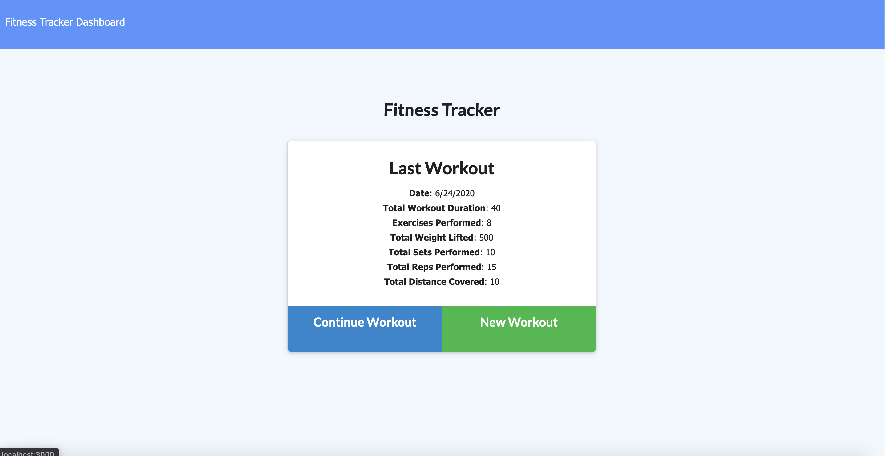
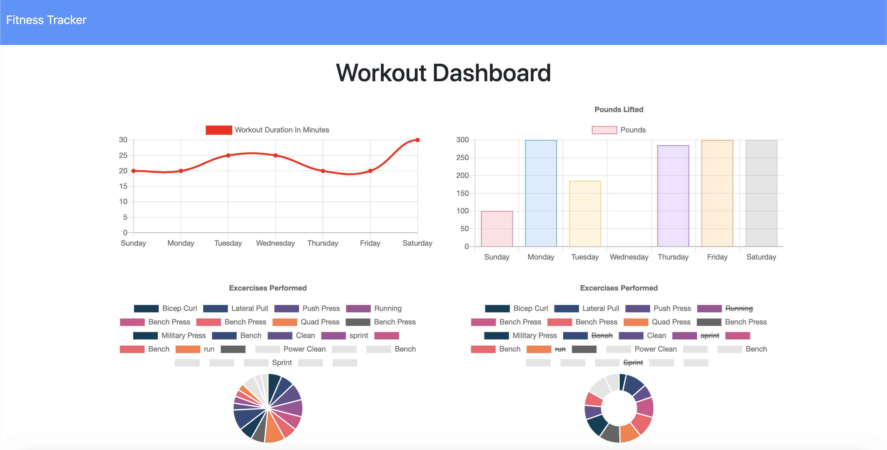

# fitness-tracker

## Description

This is an application using the Mongo Database, and Mongoose ORM, used to tracking workouts.

## Table of Contents

- [Installation](#installation)
- [License](#license)
- [Usage](#usage)
- [Contributing](#contributing)
- [Tests](#tests)
- [Questions](#questions)

## Installation

run NPM i

## License

## Usage

Deployed Link: https://protected-brook-26375.herokuapp.com/

YouTube Demonstration Link: https://youtu.be/rLmHYDxlD5Y

Animated Gif of functional applicaiton, and screenshots of home page, and states page:

## Contributing

Andrew Greer

## Tests

run NPM i

## Questions

Email: andrewgreer2015@gmail.com

Github: andrewpaulgreer